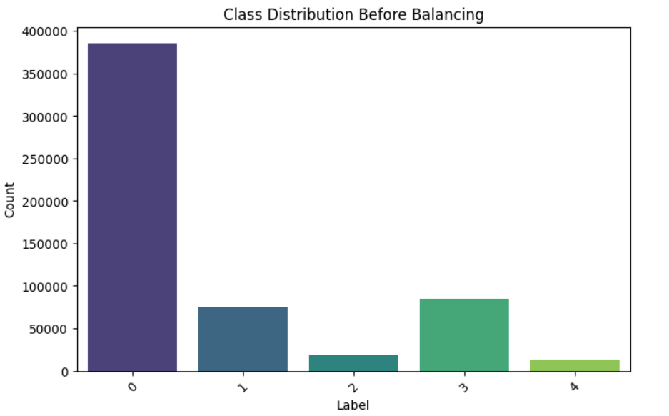
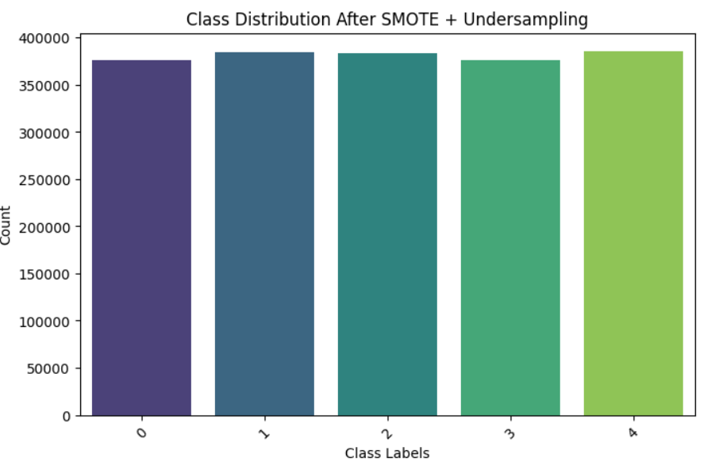
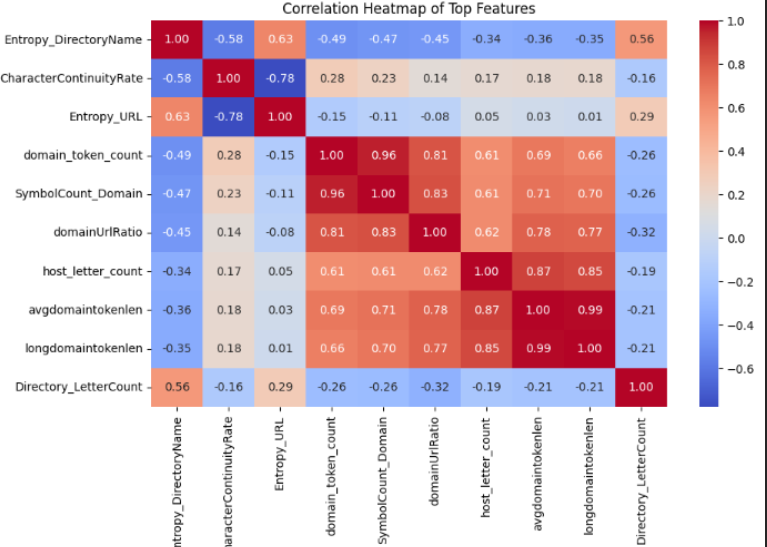
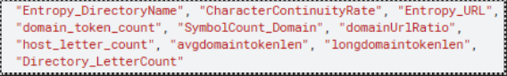
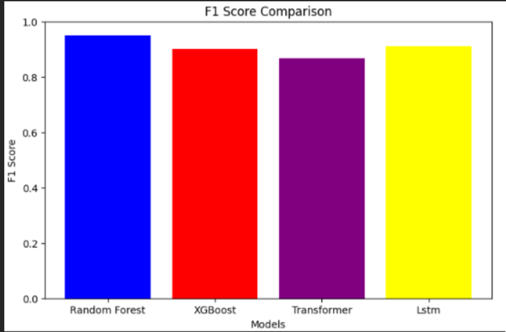
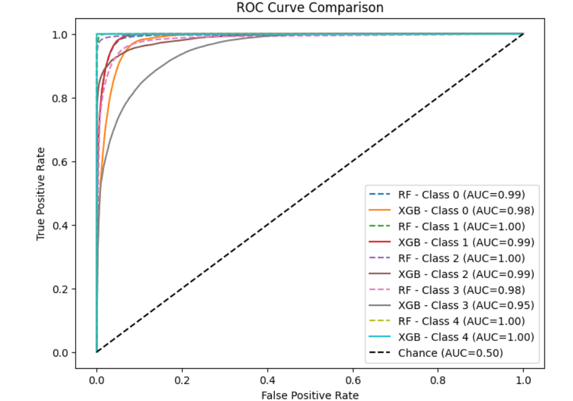
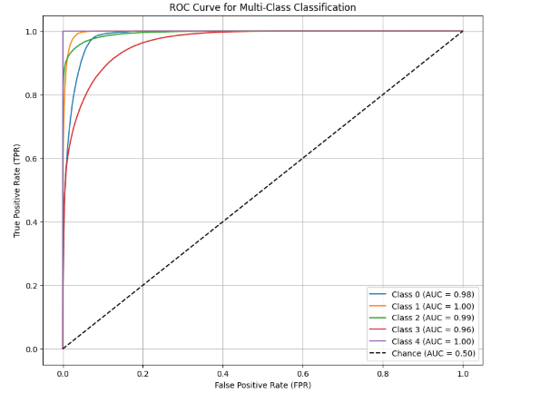

# README: URL Classification with Machine Learning and DL

# Project Overview
This project applies machine learning models to classify URLs into categories such as benign, phishing, defacement, malware, and spam. The dataset is preprocessed, and multiple models, including Random Forest (RF), XGBoost (XGB), and LSTM, LLM are trained and evaluated.

## Dataset and Preprocessing
The dataset contains 665,670 URLs with extracted features. Labels include:

- **Benign-0**: 385524
- **Defacement-3**: 84345
- **Phishing-1**: 84345
- **Malware-2**: 18506
- **Spam-4**: 12784

Data imbalance is handled using **SMOTETomek** to improve model performance.

    
    

---

## Exploratory Data Analysis (EDA)
Descriptive statistics were generated to reveal variations in URL structures. Malicious URLs exhibited distinct characteristics such as excessive use of special characters, longer lengths, and multiple subdomains.

### Visualizations:
- **URL Length Distribution**: Showed a clear distinction between benign and malicious URLs.
- **Frequency of Special Characters**: Identified patterns in phishing and spam URLs.
- **Word Cloud of Domain Names**: Provided insight into common words appearing in malicious domains.
- **Class Distribution Bar Chart**: Highlighted data imbalance.
- **Feature Importance Plot**: Showed the contribution of extracted features to the classification task.

---

## Feature Extraction
Feature engineering played a crucial role in enhancing model performance. Key extracted features included:
- **Structural Features**: URL length, number of subdomains, and presence of suspicious characters.
- **NLP-based Embeddings**: TF-IDF captured word relevance within URLs.
- **Sequence-based Extraction**: Character-level tokenization helped identify deceptive URL structures.

### UseFull Features

---

## Machine Learning & LLM-Based Models
Three categories of models were employed for malicious URL detection:

### 1. Traditional ML Models:
- **Random Forest (RF)**: Achieved the highest performance with an **F1-score of 0.95**.
- **XGBoost (XGB)**: Performed competitively but had slightly lower recall.
- **SVM**: Used for comparison but not included in final results due to lower accuracy.

### 2. Deep Learning Models:
- **Long Short-Term Memory (LSTM)**: Applied for sequence-based classification but struggled with training time and computational efficiency.

### 3. LLM-Based Models:
- **Transformer-based models like fine-tuned BERT** were explored but required high computational resources.

---

## Performance Analysis

### **Random Forest (RF):**
- Achieved the **highest F1-score**, making it the best-balanced model in terms of precision and recall.
- Handled class imbalance effectively.
- Outperformed XGBoost and LSTM across all classes except one, where XGBoost and RF were equal.

### **XGBoost (XGB):**
- Competitive performance but had lower F1-scores than RF in most classes.
- Slightly better precision than RF but lower recall.

### **LSTM:**
- Struggled compared to RF and XGBoost.
- Highest computational cost and lowest AUC-ROC scores.

### **BERT:**
- **Highest computational cost**
- Comparatively **lower F1-score** than the above three models.

---

## Results Visualization
To compare model effectiveness, the following visualizations were generated:
- **Confusion Matrices**: Showed classification errors.
- **ROC Curves**: Demonstrated the discriminatory power of models.
- **Feature Importance Graphs**: Highlighted key features influencing predictions.

    
    

Most useful features identified for predicting labels included **URL length, subdomain count, and frequency of special characters**.

---

## Challenges Faced
- **Class Imbalance**: SMOTETomek improved balance, but minority class performance remained a challenge.
- **Feature Engineering**: Required extensive analysis to determine the most informative features.
- **Hyperparameter Tuning**: Further tuning could enhance model accuracy.
- **Computational Cost**: LSTM required significantly more resources compared to RF and XGBoost.

---

## Future Improvements
- Fine-tuning hyperparameters to optimize model performance.
- Exploring advanced deep learning architectures for better sequential analysis.
- Optimizing LSTM training to reduce computational overhead.
- Investigating hybrid models that combine handcrafted features with transformer-based embeddings.

---

## Conclusion
This project successfully compared **RF, XGB, LSTM, and LLM** models for URL classification. **Random Forest emerged as the best performer**, consistently achieving higher **AUC-ROC and F1-scores** than XGBoost and significantly outperforming LSTM and LLM. Future work can focus on further tuning RF and exploring lightweight deep learning alternatives to improve efficiency without compromising accuracy.

---
